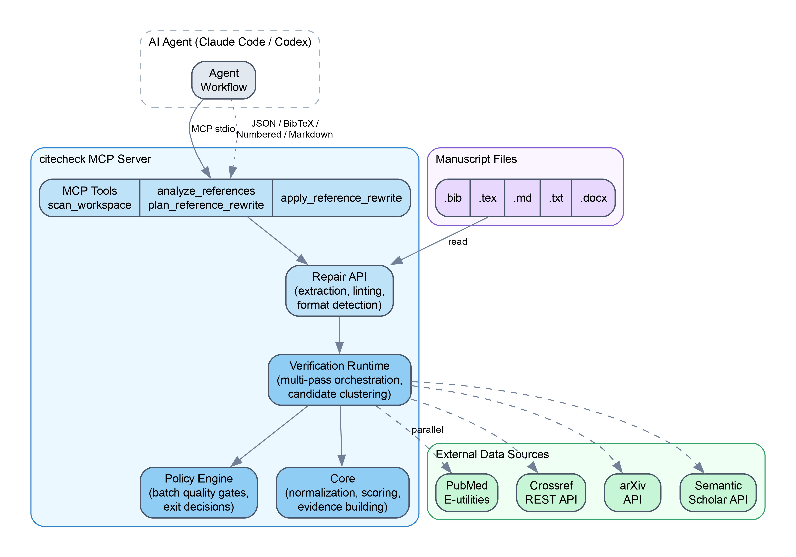

# Summary

Reference lists in scholarly manuscripts frequently contain errors, such as incorrect DOIs, misattributed authors, wrong publication years, and missing identifiers, that impede reproducibility and distort the citation record. Verifying each entry against authoritative databases is tedious when done manually, especially for manuscripts spanning biomedical, computational, and interdisciplinary literatures. `citecheck` is a TypeScript tool that automates this verification. Given a manuscript file (`.bib`, `.tex`, `.md`, `.txt`, or `.docx`), it extracts the references section, validates each entry against PubMed, Crossref, arXiv, and Semantic Scholar through a multi-pass retrieval strategy, and returns structured correction proposals with per-entry confidence scores and evidence traces. `citecheck` is distributed as a Model Context Protocol (MCP) server, allowing AI coding agents, such as Claude Code and Codex, to invoke it directly and repair bibliographies without manual intervention. Researchers who do not use AI agents can also call the repair API programmatically or inspect the structured JSON output.

# Statement of Need

`citecheck` targets two audiences: researchers preparing manuscripts who need to verify that their reference lists are accurate before submission, and developers building AI-assisted writing tools who need a programmatic bibliographic verification backend.

Reference list errors are among the most common defects in published scientific literature. Early surveys found that roughly one-third of references in public health journals contained errors [@eichorn1987], a pattern confirmed across social work [@spivey2004] and medical research, where a systematic review recalculated quotation error rates at up to 25% [@mogull2017]. These errors impede reproducibility, distort citation metrics, and undermine the scholarly record.

The rise of large language models (LLMs) in research workflows has introduced a new category of bibliographic error: citation hallucination. LLMs routinely fabricate references that appear plausible but do not correspond to real publications. They blend author names from one paper with titles from another and generate fictitious DOIs [@walters2023]. A systematic evaluation found that 19.9% of citations produced by GPT-4o were entirely fabricated, with over half of non-fabricated citations still containing bibliographic errors [@linardon2025]. At scale, the problem is already contaminating the scholarly record. An analysis of 2.2 million citations from papers published at top-tier AI/ML venues between 2020 and 2025 identified over 600 papers containing invalid or fabricated citations, with a year-over-year increase in 2025 [@xu2026]. Notably, these findings rely on recent preprints and should be interpreted with the caveat that the reported rates may be refined as the studies undergo peer review. Nevertheless, a targeted audit of NeurIPS 2025 accepted papers corroborates the trend, finding over 100 hallucinated citations across 51 published papers [@ansari2026].

Existing tools for reference management, such as Zotero [@zotero], Mendeley [@mendeley], and EndNote [@endnote], focus on organizing and formatting citations from curated personal libraries. They do not independently verify that a reference list in a manuscript accurately reflects the metadata held by authoritative registries. Citation-checking utilities such as `anystyle` [@anystyle] parse unstructured reference strings, and single-purpose converters such as `doi2bib` [@doi2bib] resolve individual DOIs to BibTeX. Neither of these approaches performs bulk cross-source validation or produces structured error classifications. The Crossref metadata API [@crossref_api] enables programmatic DOI resolution. However, using it for end-to-end bibliography repair requires substantial glue code to handle query formulation, multi-source triangulation, and safe output generation.

The emergence of the Model Context Protocol (MCP) [@mcp2024] as a standard interface between large language models and external tools creates a new opportunity. It enables a verification server that AI agents can invoke directly to inspect, validate, and repair bibliographies. By cross-referencing each entry against authoritative registries, `citecheck` serves as a guardrail against both traditional bibliographic errors and LLM-induced citation hallucinations.

# State of the Field

Reference management tools broadly fall into three categories. The first category includes personal library managers such as Zotero [@zotero], Mendeley [@mendeley], and EndNote [@endnote] that organize user-curated records. The second category comprises parsing libraries such as `anystyle` [@anystyle] and `GROBID` [@grobid] that extract structured fields from unstructured citation strings. The third category consists of metadata resolution APIs such as the Crossref REST API [@crossref_api], PubMed E-utilities [@pubmed_eutils], and Semantic Scholar API [@semantic_scholar_api] that look up individual records. None of these categories alone addresses the end-to-end problem of validating an existing reference list against multiple authoritative sources, classifying discrepancies, and producing replacement-safe output.

Single-purpose converters such as `doi2bib` [@doi2bib] resolve a DOI to BibTeX but cannot detect inconsistencies between stated metadata in a manuscript and registry records. `GROBID` excels at PDF-to-structured-data extraction but does not perform cross-source validation or produce repair proposals. Each API covers a subset of the scholarly literature. For instance, biomedical manuscripts typically require querying PubMed and Crossref together, plus arXiv for preprints. No existing tool orchestrates these sources with progressive query reformulation, candidate clustering, and batch-level quality assessment.

A new tool was needed rather than an extension to existing managers because the core problem is verification against external ground truth, not organization of a personal library. Building on MCP rather than a plugin API for a specific reference manager ensures that any MCP-capable agent, regardless of vendor, can invoke `citecheck` without additional integration work. `citecheck` addresses this gap by integrating four data sources behind a unified verification runtime with a multi-pass search strategy.

# Software Design

## Multi-Source Verification

No single bibliographic database covers all of scholarly publishing. PubMed is authoritative for biomedical literature but lacks coverage of computer science and preprints. Crossref has broad DOI coverage but limited metadata depth. arXiv provides preprint identifiers that are absent from other sources. Semantic Scholar adds citation counts useful for enrichment. `citecheck` queries all four in parallel so that a single missing source does not cause a false negative. This design trades higher network cost for recall since connector calls execute concurrently, and latency is thus bounded by the slowest source rather than the sum.

## Multi-Pass Retrieval

A single query formulation often fails when the reference text is incomplete or unconventional. Rather than returning unresolved immediately, the runtime reformulates the query up to two additional times. It first normalizes the title with author and year anchors, and then broadens the search to alternative source combinations. This progressive strategy accepts additional API calls in exchange for substantially higher retrieval rates on real-world manuscripts where references lack strong identifiers.

## Policy-Gated Output

Automated bibliography replacement is risky because a misidentified candidate can silently corrupt a reference list. `citecheck` separates analysis from modification through a two-mode design, review versus replacement, and a batch-level policy engine. The policy engine evaluates aggregate verification outcomes, including failure rates, source health, and confidence distributions, against configurable thresholds such as default, strict, or lenient. Replacement output is blocked unless safety checks pass for every entry. This conservative default reflects the principle that a false correction is worse than no correction.

## Architecture

The codebase, illustrated in \autoref{fig:architecture}, is organized into four modules. The Connectors module contains HTTP clients implementing a shared `ReferenceConnector` interface with per-source rate limiting. The Core module handles normalization, Jaccard-based similarity scoring, candidate clustering, and evidence building. The Runtime module manages multi-pass orchestration with configurable batch concurrency. The Policy module provides batch-level quality gates. The MCP server exposes six tools following a progressive-disclosure workflow, documented in the project README. Output is available in JSON, BibTeX, numbered text, Markdown, or EndNote format.

{ width=80% }

# Research Impact Statement

`citecheck` has been used by the authors to verify and repair reference lists in manuscripts under preparation, including a longitudinal brain metastases study with 37 references across biomedical and machine-learning literatures. In that manuscript, `citecheck` identified missing DOIs in 34 of 37 entries, flagged one identifier mismatch, and detected one ambiguous entry. These corrections would have required several hours of manual cross-referencing.

The tool is published on npm as `@citecheck/mcp` and can be installed as an MCP server for Claude Code or Codex with a single command. As MCP adoption grows in research-oriented AI agent workflows, `citecheck` provides infrastructure for maintaining bibliographic integrity without requiring researchers to leave their agent-assisted writing environment.

# AI Usage Disclosure

Generative AI tools, specifically Claude Code with Claude Opus 4, were used during the development of `citecheck` for code generation assistance, test scaffolding, and iterative debugging. All AI-generated code was reviewed, tested, and validated by the author. A test suite containing 47 unit and integration tests plus over 40 fixture-based regression scenarios was used to verify correctness throughout development. This paper was drafted with AI assistance and reviewed by the author for accuracy and completeness.

# Acknowledgements

The authors thank the maintainers of the PubMed E-utilities, Crossref REST API, arXiv API, and Semantic Scholar Academic Graph API for providing open access to bibliographic metadata. `citecheck` uses the Model Context Protocol SDK developed by Anthropic.

# References
